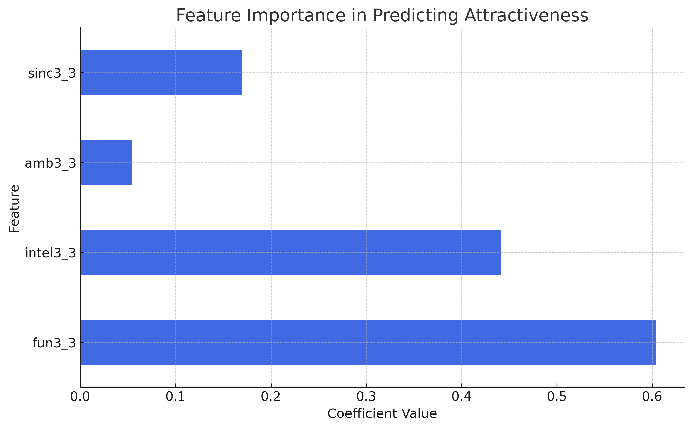
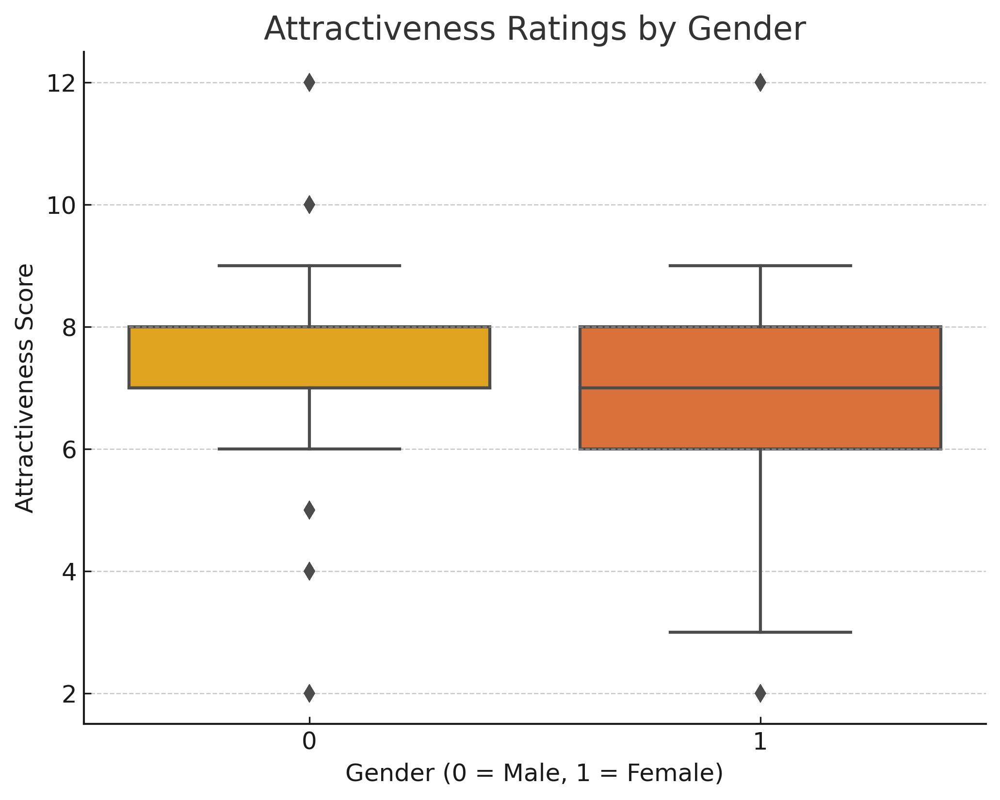
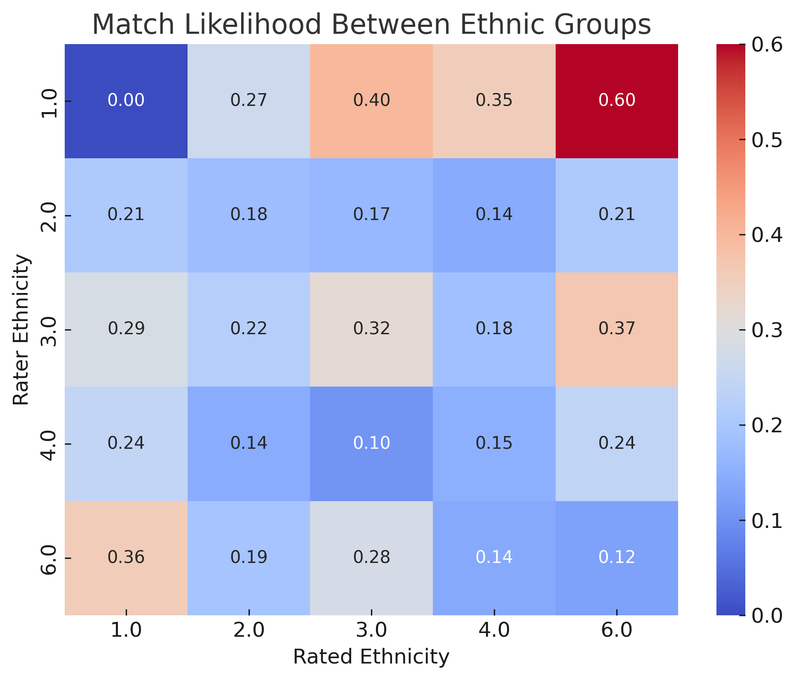

# ❤️ Predicting Attractiveness in Dating Markets

## 📌 Project Purpose
This project analyzes attractiveness and dating preferences using a **Speed Dating dataset from Columbia University (2002-2004)**. The study focuses on understanding:
- ✅ What makes someone attractive across different traits?
- ✅ How do men and women differ in their dating preferences?
- ✅ How do different ethnic groups interact in the dating scene?

---

## 📊 Dataset Description
The dataset consists of **542 participants** (273 males, 269 females) aged **20-35**, who participated in speed dating experiments. Below is a breakdown of the key features used in the analysis:

| **Feature**           | **Description**                                      |
|----------------------|--------------------------------------------------|
| `sincerity`         | Rating of perceived sincerity (1-10)             |
| `intelligence`      | Rating of perceived intelligence (1-10)          |
| `fun`              | Rating of perceived fun (1-10)                    |
| `ambition`         | Rating of perceived ambition (1-10)               |
| `shared_interests`  | Rating of shared interests with a partner (1-10) |
| `age`              | Age of participant                                |
| `attractiveness`   | Overall attractiveness rating (1-10)              |
| `gender`           | 0 = Male, 1 = Female                              |
| `ethnicity_1`      | Participant's ethnicity                           |
| `ethnicity_2`      | Partner's ethnicity                               |
| `match`            | 1 if participants matched, 0 otherwise            |

---

## 🏷 Methodology
### 1️⃣ Data Collection
- The **Speed Dating dataset** from Columbia University (2002-2004) was used.
- Participants' ratings on **attractiveness, sincerity, intelligence, fun, ambition, and shared interests** were analyzed.
- Data preprocessing involved handling missing values and standardizing attributes.

### 2️⃣ Data Analysis
- **Regression models** were used to predict attractiveness based on various personality traits.
- **Box plots** were used to analyze gender-based preferences.
- **Heatmaps** were generated to study ethnic group interactions in dating.

### 3️⃣ Data Visualization
- Feature importance in predicting attractiveness.
- Gender-based attractiveness ratings.
- Ethnic group interaction matrix.

---

## 🔍 Key Findings & Insights
- **Factors influencing attractiveness**:
  - 🎉 Fun and shared interests contribute most to attractiveness.
  - 📉 Ambition and age have a lower impact.
- **Gender differences**:
  - 👨 Men prioritize attractiveness and fun.
  - 👩 Women value intelligence more.
- **Ethnic group interactions**:
  - 🖤 Black/African Americans rated Latinos highly.
  - 🔴 Native Americans favored Black and Latino partners.
  - 🟡 Asians showed the least preference for other Asians.

---

## 📊 Visualizations
### **Feature Importance in Predicting Attractiveness**

### **Attractiveness Ratings by Gender**

### **Ethnic Group Interactions in Dating**

---

## 🚀 Business & Social Implications
- **For individuals**: Provides data-driven insights into what makes people attractive in dating.
- **For dating platforms**: Helps optimize matchmaking algorithms based on preferences and behavioral trends.
- **For sociologists & researchers**: Offers a historical perspective on dating preferences and potential cultural shifts.

---

## 🛠 Technologies Used
- **Python**
  - pandas & numpy for data preprocessing
  - scikit-learn for regression modeling
  - matplotlib & seaborn for data visualization

---

## 📂 Repository Files
- **dating_market_analysis.py** – Script for data analysis and visualization.
- **README.md** – Project documentation.

---

## 📢 Authors & Acknowledgments
- **Team 14A**: Ariel Liang, Brandon Phan, Hoonyoung Jung, Mingzhu Pan
- **Data Source**: Columbia University Speed Dating Experiment (2002-2004)

---

## 📌 Future Enhancements
- 🔹 Expand analysis to **modern dating trends** (e.g., online dating apps).
- 🔹 Incorporate **sentiment analysis** from dating profiles.
- 🔹 Develop a **machine learning model** for better matchmaking predictions.

📂 **Presentation Link**: [Google Slides: Speed Dating Analysis](https://ucirvine-my.sharepoint.com/:p:/g/personal/ariel13_ad_uci_edu/Eb2LFynLVG5AotC6hpX_-28BDEV_NqqPXv5463A9BD7UPA?wdOrigin=TEAMS-WEB.undefined_ns.rwc&wdExp=TEAMS-TREATMENT&wdhostclicktime=1740378730392&web=1)

For questions or contributions, feel free to reach out! 🚀

 
